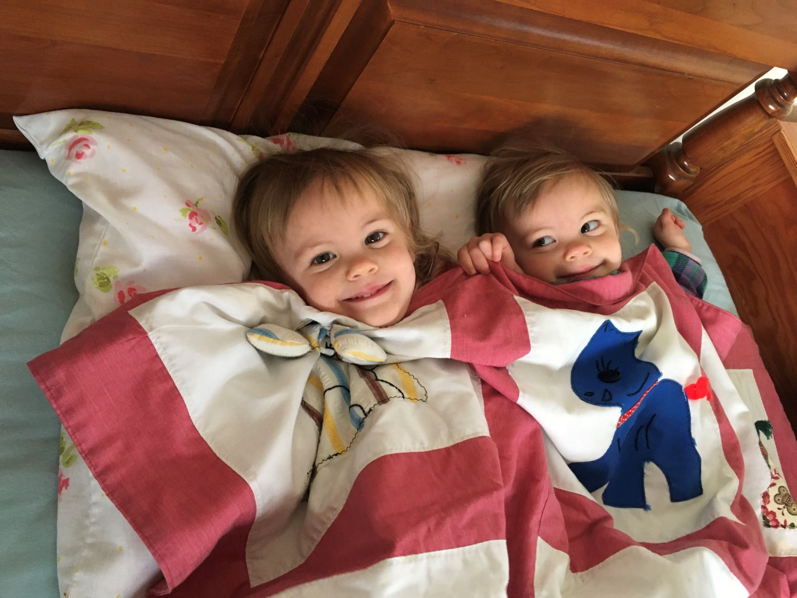

% Arnolds New Years Letter 2020

Happy New Decade!

Highlights:

-   We've moved to Grand Rapids, Michigan! We miss Boston and our
    friends there (who helped us immensely with the move, by the way),
    but we've started to appreciate Grand Rapids on its own terms.
-   Ken started teaching Computer Science and Data Science at Calvin
    University! The first semester was joyfully overwhelming. Ken feels
    increasingly thankful and blessed to be there.
-   Susan has mostly been at home with Naomi and Esther. For ten weeks
    last spring, she went back to work part time for her former
    architecture firm, with the help of a wonderful nanny. She felt like
    that was a nice balance and is hoping to find a similar part time
    schedule here, once she finishes her architecture professional
    exams.
-   Naomi and Esther celebrated their second birthday in November. They
    have learned so much, going from not talking at the beginning of the
    year, to putting ever more complex phrases together.

Other tidbits:

-   2019 started with a New Year's Day hike in Maryland with Ken's
    brother Austin and (now) fiancée Mason, and finished with Ken's
    parents visiting us in Grand Rapids for New Years 2020.
-   Ken's parents visited us frequently during the year (coming from
    Maryland) and Susan's parents visited Boston over the summer to help
    us pack up for our move.
-   Naomi and Esther were baptized at Citylife Church in Boston in June,
    with all grandparents attending. Baptism is a symbol of the faith we
    share and our hopes that the girls will grow in that faith as part
    of Christian community.
-   We enjoyed Christmas in Portland, Oregon with Susan's parents.
-   We are now located closer to Susan's extended family in Michigan.
-   We bought a minivan (a like-new Honda Odyssey)!

Looking forward to:

-   Ken teaching another two classes this spring, and hopefully finally
    defending his PhD thesis (long story).
-   Upcoming travels: to Ken's brother Austin's wedding mid-October, Ken
    traveling to Italy in March to present a paper at a conference (it
    finally got accepted on the third try), and maybe a few days
    vacationing by Lake Michigan this summer with one of Susan's
    friends.
-   Getting connected with a local church.
-   Susan continuing in professional development and maybe starting
    work.
-   Naomi and Esther continuing to grow, and we're considering starting
    preschool this year.

Our new address is 3654 Palmer Ridge Road SE, Grand Rapids MI 49546.

With love,

Ken, Susan, Esther and Naomi

{ width=100% }

more photos
[here](https://www.dropbox.com/sh/fvf904ukclrx24o/AABhgJlNi8pvvHkFc805YNdea?dl=0).
